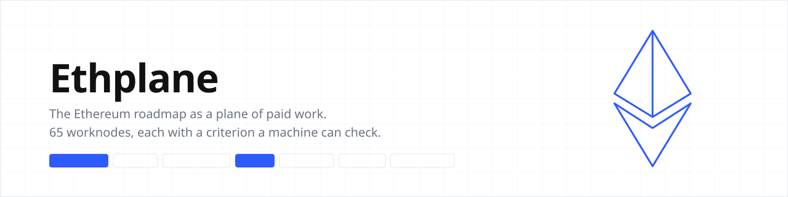

# Ethplane

The Ethereum Foundation publishes a roadmap called the strawmap: 65 items of research and engineering work, sorted by layer and by the fork they target. Ethplane takes that map and makes each item something you can work on and get paid for.

Each item is a Roadmap Worknode. A worknode has three parts: a name on ENS, so it can be found and its state read from anywhere; an acceptance criterion a machine can check, for example fewer VM cycles than 1,542,812; and an escrow of PLANE tokens that pays out when a verifier confirms a submission meets the criterion.

You work a worknode by starting a session on it, from the current best version, alone or with a swarm of local models. When you have an improvement, you submit it. The worknode's verifier rebuilds your submission from the reference, runs the check, and records a verdict on chain. A pass releases the escrow by a fixed split: most to you, a share to whoever's work you built on, a share to the verifier. A fail costs nothing and is recorded with its reason.

**Live:** https://ethplane.ecofrontiers.xyz

**Video:** <!-- Pat: demo link -->

**ENS:** every worknode is a name you can resolve, and its status, criterion and head are text records on our own ENSv2 subregistry under `ethplane.eth`. Status and head are written by the verifier, which holds the writer role for those keys; the resolver's owner can also write them.

**Privy:** the treasury signs only under a policy, so it can fund and define worknodes and nothing else, and joining needs no wallet of your own: sign in with an email and Privy creates one.

## Live on Sepolia

Two worknodes are open, each funded with 10,000 PLANE, both carrying the same task: make leanVM aggregate 900 signatures in fewer VM cycles than the reference, which takes 1,542,812.

Seven submissions have been judged and none passed. Two could not be built. Two ran and produced exactly the baseline count. Three cut cycles by 1,350 and made the proof 307 bytes larger, and proof size is allowed no growth at all.

The table with every transaction is on [the docs page](https://ethplane.ecofrontiers.xyz/docs#sepolia) and in `docs/JUDGES.md`. Addresses are in `docs/DEPLOYMENTS.md`.

## Run it yourself

```
git clone https://github.com/papa-raw/ethplane && cd ethplane

# the site: writes web/out
cd web && pnpm install && pnpm build

# the read API
cd api && pnpm install && pnpm build && node dist/src/server.js

# the verifier, on one artifact
LEANVM_REF=/path/to/leanVM python3.12 verifier/run.py <artifact.tar> --self-test
```

Tests are `pnpm vitest run` in `web/`, and `python3.12 -m pytest verifier/tests swarm/tests -q` at the root.

## Join

Sign in with an email at https://ethplane.ecofrontiers.xyz/join. Privy creates a wallet and you get a name under `guests.ethplane.eth`.

`ethplane join <your-name>` rebuilds a worknode's verified state from its name.

Then start a session on either open worknode and submit; the page you start from lists the criterion and the current head.

## Repository layout

- `contracts/`, `script/`, `test/`: Ethplane, PlaneToken, EthplaneSubregistry, EthplaneResolver, and their Foundry tests.
- `api/`: the indexer, a viem log poller, over SQLite, with the read API the site polls.
- `web/`: the site, a Next.js static export.
- `cli/`: `ethplane resolve|join`.
- `verifier/`: the measurement runner and the watcher that records verdicts.
- `swarm/`: the role scripts for a local-model swarm.
- `docs/`: SPEC, CRITERION, DEPLOYMENTS, ENS-PROBES, JUDGES and the rest.
- `research/`: the strawmap and the tables behind it.

Planning artifacts, redacted, are in `docs/planning/`. Who wrote what is in `ATTRIBUTION.md`. Built for ETHOnline 2026.
